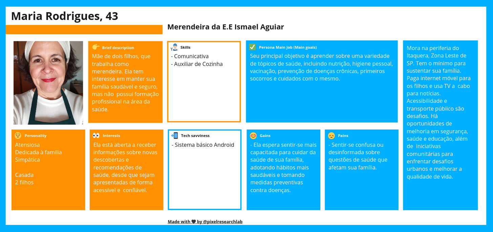
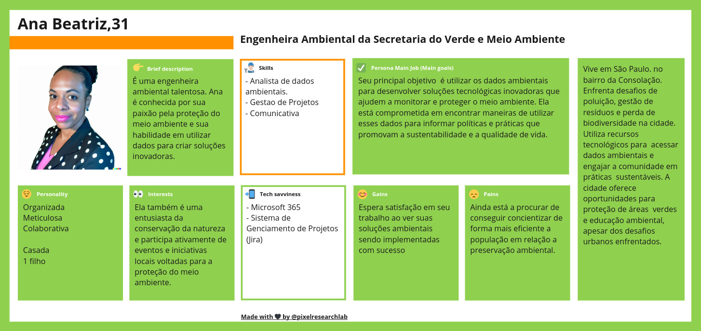
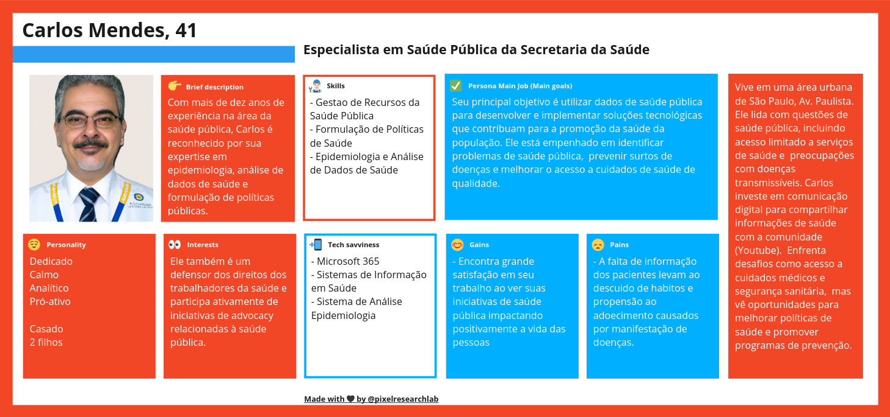

# Personas

Uma persona é uma representação fictícia de um usuário típico de um produto, serviço ou sistema, baseada em dados reais e pesquisas sobre os usuários reais. O objetivo principal de criar uma persona é ajudar as equipes de desenvolvimento, marketing e design a entenderem melhor as necessidades, desejos, comportamentos e características dos usuários finais.

Devido ao público muito amplo em que a nossa solução será disponibilizada, foram pensadas 3 personas, cada uma com suas peculiaridades e objetivos próprios para o uso dos dados dispostos no dashboard. Sendo assim, são elas:

* Eu como funcionária pública, quero poder acessar o dashboard pelo celular, para que eu possa consulta-lá em qualquer lugar com cobertura de internet.
* Eu como funcionária pública, quero poder acessar o dashboard  para me manter informada, principalmente recomendações de saúde, em que posso compartilhar com a minha família.

  
  

* Eu como Engenheira Ambiental , quero poder acessar o dashboard pelo computador, para que eu possa planejar ações na cidade de São Paulo em conjunto com a Secretaria.
* Eu como Engenheira Ambiental, quero poder acessar o dashboard com o meu login, para ter acesso aos dados filtrados para o meu uso em específico.
* Eu como Engenheira Ambiental, quero poder compartilhar aos dados que possuo, para que eu possar ajudar a concientizar a população.

  
  

* Eu como funcionário da saúde, quero consultar o dashboard, para poder ver se existem evidências do aumento de doenças em relação ao aumento da temperatura (Exemplo)
* Eu como funcionário da saúde, quero consultar o dashboard, para poder ver tendências de dados e organizar tratamentos com maior frequência.
* Eu como funcionário da saúde, quero consultar o dashboard com o meu login, para acessar dados de meu interesse.