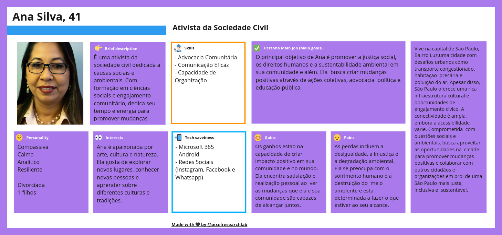

# Personas

Uma persona é uma representação fictícia de um usuário típico de um produto, serviço ou sistema, baseada em dados reais e pesquisas sobre os usuários reais. O objetivo principal de criar uma persona é ajudar as equipes de desenvolvimento, marketing e design a entenderem melhor as necessidades, desejos, comportamentos e características dos usuários finais.

Devido ao público muito amplo em que a nossa solução será disponibilizada, foram pensadas 3 personas, cada uma com suas peculiaridades e objetivos próprios para o uso dos dados dispostos no dashboard. Sendo assim, são elas:

* **Para maior riqueza de detalhes, acesso o link no fim dessa página**

* Eu como funcionária pública, quero poder acessar o dashboard pelo celular, para que eu possa consulta-lá em qualquer lugar com cobertura de internet.
* Eu como funcionária pública, quero poder acessar o dashboard  para me manter informada, principalmente recomendações de saúde, em que posso compartilhar com a minha família.

  
  

* Eu como Engenheira Ambiental , quero poder acessar o dashboard pelo computador, para que eu possa planejar ações na cidade de São Paulo em conjunto com a Secretaria.
* Eu como Engenheira Ambiental, quero poder acessar o dashboard com o meu login, para ter acesso aos dados filtrados para o meu uso em específico.
* Eu como Engenheira Ambiental, quero poder compartilhar aos dados que possuo, para que eu possar ajudar a concientizar a população.

  
  

* Eu como funcionário da saúde, quero consultar o dashboard, para poder ver se existem evidências do aumento de doenças em relação ao aumento da temperatura (Exemplo)
* Eu como funcionário da saúde, quero consultar o dashboard, para poder ver tendências de dados e organizar tratamentos com maior frequência.
* Eu como funcionário da saúde, quero consultar o dashboard com o meu login, para acessar dados de meu interesse.

  
  

* Eu como ativista da sociedade civil, quero participar de grupos de discussão online sobre questões ambientais, para compartilhar ideias e estratégias com outros membros da comunidade interessados em promover a sustentabilidade.
* Eu como ativista da sociedade civil, quero acessar informações sobre eventos ambientais locais, para poder participar de ações de plantio de árvores, limpeza de parques e outras iniciativas de conservação.
* Eu como ativista da sociedade civil, quero colaborar com ONGs e organizações ambientais, para desenvolver campanhas de conscientização sobre a importância da preservação ambiental e da redução do consumo de plástico.

# Desenvolvimento

O desenvolvimento da Persona foi feito na plataforma Miro. Para consultar todas com maior nível de detalhes, segue o Link abaixo:

https://miro.com/app/board/uXjVNwLNsDA=/?share_link_id=603614583331