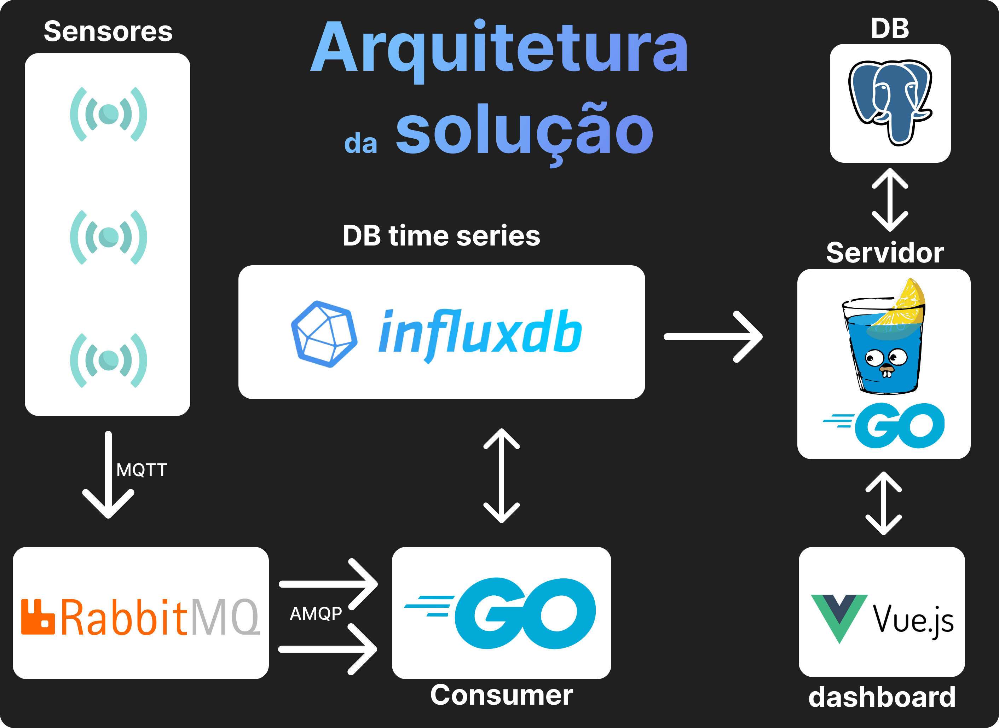

# Arquitetura da solução - Versão 2

### Alterações:

- O Kafka foi substituído pelo RabbitMQ, pela facilidade de uso e broker MQTT interno, eliminando o uso do HiveMQ, por exemplo.

- Separamos o servidor e o consumidor do RabbitMQ em dois serviços diferentes, permitindo que eles escalem de forma independente.

- Next.js substituido por Vue.js, por ser mais leve e mais fácil de usar.

- Adicionamos um banco de dados relacional (Postgresql) para armazenar os dados dos usuários,autenticação e as configurações do dashboard de cada usuário. 