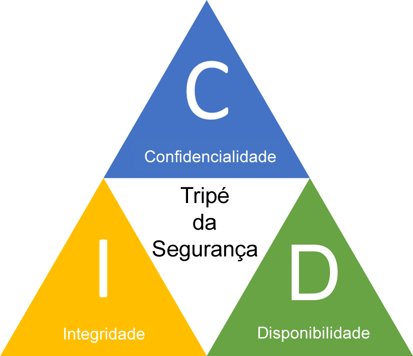
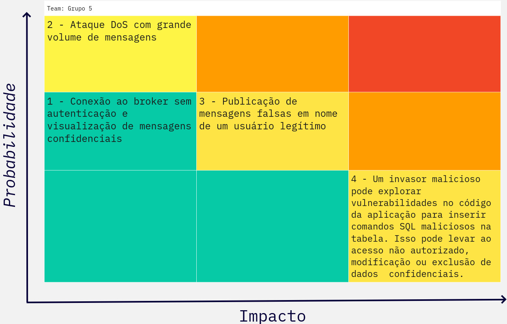

# Segurança

A Triade da CIA (Confidencialidade, Integridade e Disponibilidade) é um modelo clássico de segurança da informação que é frequentemente utilizado para orientar políticas de segurança e medidas de proteção de dados. No projeto, foi utilizada para garantir tópicos importantes de segurança como demonstrado abaixo:

  

* Confidencialidade:
    Na arquitetura MQTT, a confidencialidade refere-se à proteção das informações transmitidas entre os dispositivos e o broker MQTT. Isso pode ser alcançado usando técnicas de criptografia para garantir que apenas os destinatários autorizados possam acessar e entender os dados transmitidos. Por exemplo, é comum usar TLS (Transport Layer Security) para criptografar as comunicações MQTT, protegendo os dados contra acessos não autorizados.

* Integridade:
    A integridade em uma arquitetura MQTT significa garantir que os dados transmitidos não sejam alterados ou corrompidos durante a comunicação. Isso é importante para garantir a precisão e a confiabilidade dos dados. Para garantir a integridade dos dados MQTT, podem ser usadas técnicas como o uso de códigos de hash ou assinaturas digitais para verificar se os dados foram alterados ou adulterados durante a transmissão.

* Disponibilidade:
    A disponibilidade refere-se à capacidade do sistema de estar operacional e acessível quando necessário. Em uma arquitetura MQTT, a disponibilidade é fundamental para garantir que os dispositivos possam se conectar e comunicar com o broker MQTT sempre que necessário, sem interrupções. Isso pode ser alcançado através do dimensionamento adequado da infraestrutura, redundância e implementação de medidas para lidar com possíveis falhas de rede ou do servidor.
  
  

# Matriz Probabilidade x Impacto

Durante a análise de segurança do projeto, a Probabilidade x Impacto visa fornecer uma compreensão mehlor dos tópicos que requerem atenção especial, destacando a probabilidade de ocorrência em relação ao impacto potencial. Mediante disso, foi criar uma matriz e destacado 4 tópicos.

  

Após a classificação, é necessário tambem entender quais sãos os impactos negativos caso essa obeservações aconteçam e tambem como mitiga-lás.

## Impacto dos Cenários

1 - Divulgação de informações confidenciais, perda de reputação, danos financeiros.

2 - Indisponibilidade do serviço, perda de produtividade, danos financeiros.

3 - Tomada de decisões com base em informações incorretas, danos à reputação do usuário, interrupção de processos.

4 - Acesso não autorizado a dados confidenciais., Modificação ou exclusão de dados importantes. Interrupção da operação da aplicação.

## Mitigações

1 - Configurar autenticação e criptografia de dados, implementar controles de acesso, monitorar logs.

2 - Implementar mecanismos de proteção contra DoS, dimensionar a infraestrutura, monitorar o desempenho.

3 - Implementar assinaturas digitais, validação de origem das mensagens, monitoramento de logs.

4 - Utilize parâmetros parametrizados para consultas SQL, Valide a entrada do usuário para evitar comandos maliciosos.

  
  

# Desenvolvimento

O desenvolvimento da Persona foi feito na plataforma Miro. Para consultar todas com maior nível de detalhes, segue o Link abaixo:

https://miro.com/app/board/uXjVNgrsSbY=/?share_link_id=749826125322