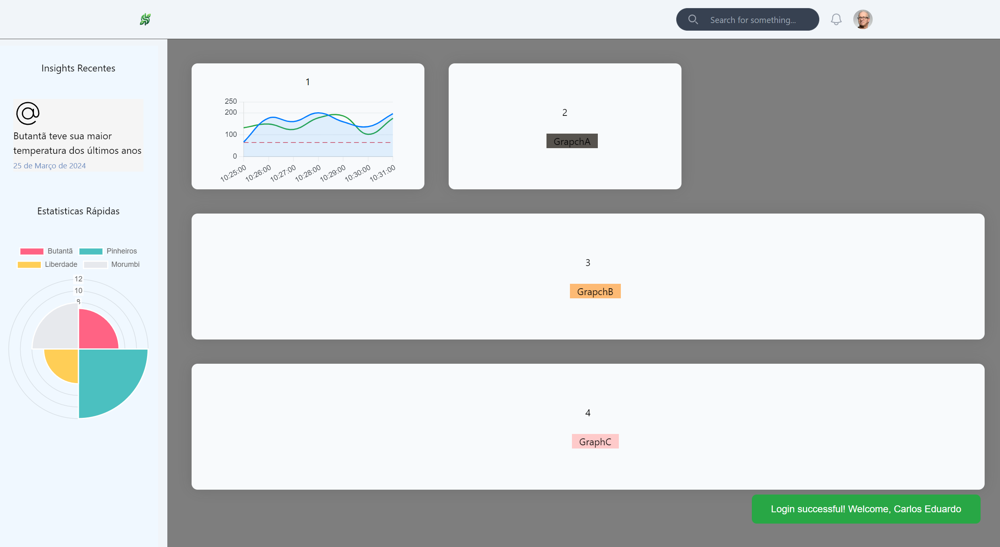
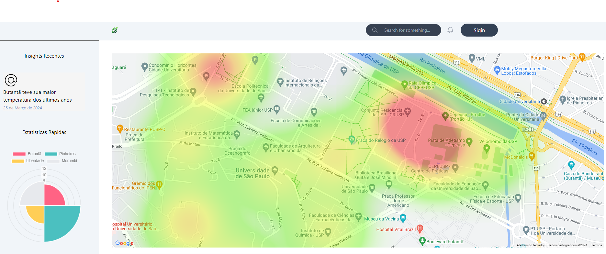

# Desenvolvimento da Interface

Como especificado na Arquitetura, o Front-end da solução foi desenvolvida em um framework chamado Vue.js, um framework progressivo de JavaScript utilizado para construir interfaces de usuário (UI) e single-page applications (SPAs). Algumas caracterísca principais:

### Características Principais do Vue.js:

- **Reatividade:** O Vue.js utiliza um sistema de reatividade que permite atualizar automaticamente a interface do usuário sempre que os dados do modelo mudam.
  
- **Componentização:** O Vue.js incentiva a construção de interfaces de usuário reutilizáveis através do conceito de componentes, que podem ser combinados para formar uma aplicação completa.

- **Diretivas:** O Vue.js utiliza diretivas para adicionar funcionalidades declarativas ao HTML, facilitando a manipulação do DOM de forma intuitiva.

- **Integração:** É fácil integrar o Vue.js com outras bibliotecas ou projetos existentes, permitindo uma adoção gradual ou modularização de funcionalidades.

- **Ecossistema:** O Vue.js possui um ecossistema robusto com diversas bibliotecas e ferramentas, como Vuex para gerenciamento de estado, Vue Router para roteamento e Vue CLI para criação de projetos.

Sendo assim, a página de Login, já integrado com autenticação e credencialmente, em conjunto com a página base do Dashboard para visualização dos dados já foram desenvolvidas conforme planejado. Segue abaicxo as imagens do desenvolvimento abaixo:

## Login
Com autenticação e crendenciamento

## Dashboard Login
O Dashboard se adaptar conforme as configurações aplicadas de cada logado na plataforma, vale ressaltar que esse login é dedicado as secreterias e não para um usuário público. Se intuito é aplicar filtros e configurações conforme cada usuário deseja, facilitando a visualização.

## Dashboard Público
O Dashboard público é visado para o público em geral, trazendo informações de forma mais genérica e que qualquer pessoas consiga acessar.

## Mapa de Calor
O Componente 'HeatMap' (Mapa de Calor) tem a função de indicar para o usuario, em um mapa interativo, a temperatura média da região. Através da API do Google Maps, plotamos no mapa um ponto de latidude e longitude, com um peso especifico. 

Essas pontos de coordenadas virão do nosso backend com as informações dos sensores, e o peso de cada ponto será definido através da conversão do valor de temperatura do sensor, para uma escala de maximo e minimo de temperatura. Implementaremos na próxima sprint os indicadores visuais desses valores de temperatura para uma escala de cores, facilitando a compreensão por parte do usuário
