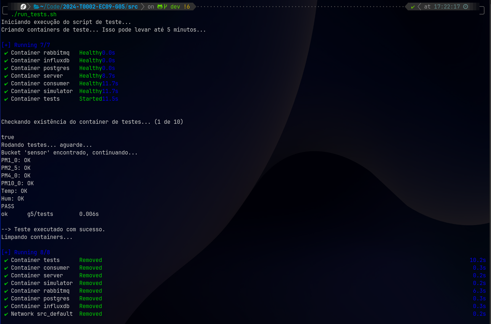

# Testes

Todos os testes de integração e unitários do projeto são executados por um script Go localizado na pasta `src/tests`.

O script `run_tests.sh` na pasta `src/` é responsável por executar todos os testes do projeto. Ele executa o sistema completo, além do container de testes mencionado.

Para rodar os testes na sua máquina, execute o script com:

`cd src && ./run_tests.sh`

### Resultados esperados

É esperado que todos os testes passem. Verifique código de saída do script. Qualquer código diferente de 0 indica falha nos testes.

### CI/CD

O script `run_tests.sh` é executado automaticamente pelo Github Actions do projeto. O símbolo de check ao lado de um commit evidência o resultado dos testes para aquele commit específico:

